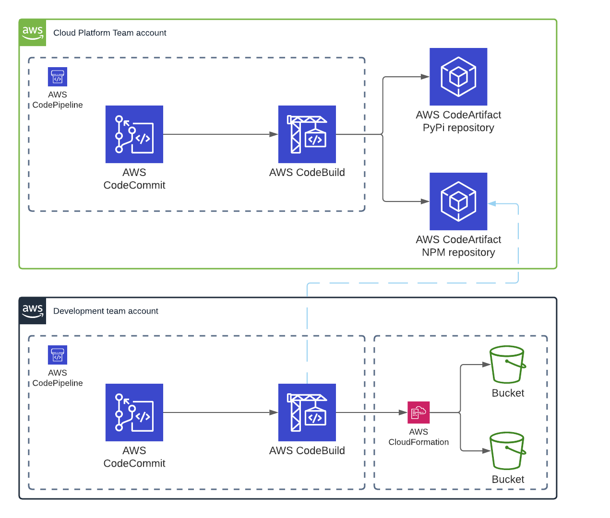

# clubcloud-construct-consumer
This repository contains the code required to set up your first hello-world CDK construct pipeline, as demonstrated in the Club Cloud "WORKSHOP: ACCELERATE YOUR CLOUD ADOPTION WITH THE AWS CLOUD DEVELOPMENT KIT" session on November 1st 2021 at https://clubcloud.world.

This repository is third in a set of 3 Github repositories that are required to provision the end-to-end chain:
1. https://github.com/sborregodiaz/clubcloud-construct-pipeline
2. https://github.com/sborregodiaz/clubcloud-construct
3. https://github.com/sborregodiaz/clubcloud-construct-consumer

The part highlighted in green on the diagram below is the focus of this repository  



## Instructions
0. Install [git-remote-codecommit](https://docs.aws.amazon.com/codecommit/latest/userguide/setting-up-git-remote-codecommit.html#setting-up-git-remote-codecommit-prereq)
0. Assume your IAM role into the secondary AWS account in the same AWS organization
1. Clone this repository
2. Obtain a AWS CodeArtifact Authorization Token by running `aws codeartifact get-authorization-token --domain clubcloud-domain --domain-owner <DOMAIN_ACCOUNT_ID> --query authorizationToken --output text`. Replace the value of `<DOMAIN_ACCOUNT_ID>` by the AWS account ID used in the first two
3. Replace the placeholders with the correct values and add the following to `~/.npmrc`:
```
registry=https://clubcloud-domain-<DOMAIN_ACCOUNT_ID>.d.codeartifact.<REGION>.amazonaws.com/npm/clubcloud-npm-platform-constructs/
//clubcloud-domain-<DOMAIN_ACCOUNT_ID>.d.codeartifact.<REGION>.amazonaws.com/npm/clubcloud-npm-platform-constructs/:_authToken=<TOKEN>
//clubcloud-domain-<DOMAIN_ACCOUNT_ID>.d.codeartifact.<REGION>.amazonaws.com/npm/clubcloud-npm-platform-constructs/:always-auth=true
```
4. Replace the values of `<DOMAIN_ACCOUNT_ID>` and `<DEV_ACCOUNT_ID>` in `src/pipeline-stack.ts`
5. Run `npx projen build`
6. Run `npx projen deploy`
7. Confirm the deployment of resources
8. Run `git remote add codecommit codecommit::<REGION>://clubcloud-consumer-app`
9. Run `git add .`
10. Run `git commit -m "Initial commit"`
11. Run `git push codecommit main`

## Useful links
* [CDK](https://github.com/aws/aws-cdk)
* [Projen](https://github.com/projen/projen)
* [CDK Pipelines](https://aws.amazon.com/blogs/developer/cdk-pipelines-continuous-delivery-for-aws-cdk-applications/)
* [AWS CodeArtifact - Configure and use npm](https://docs.aws.amazon.com/codeartifact/latest/ug/npm-auth.html)